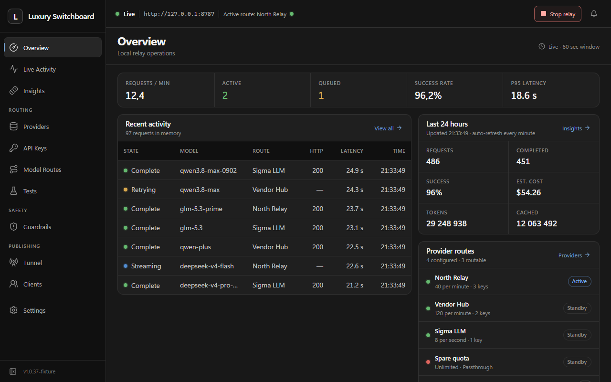
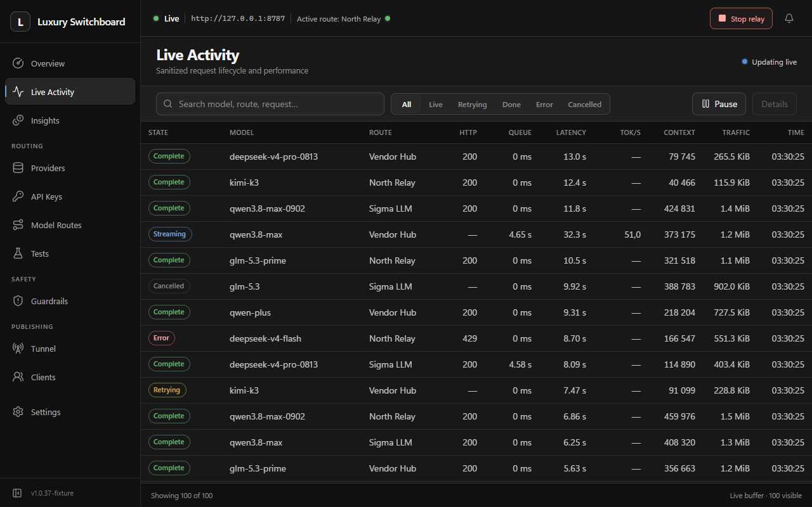
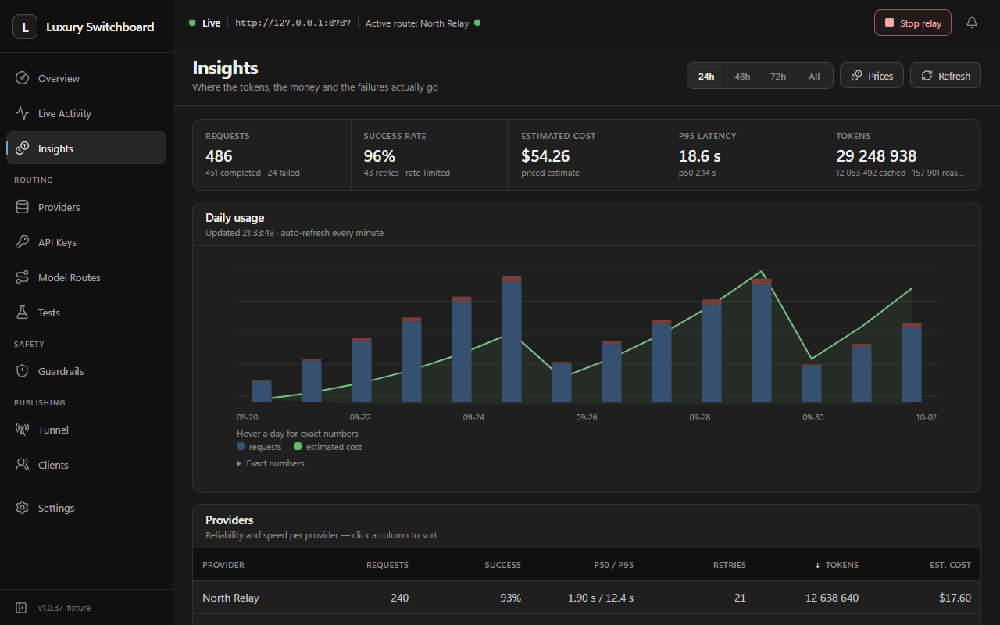
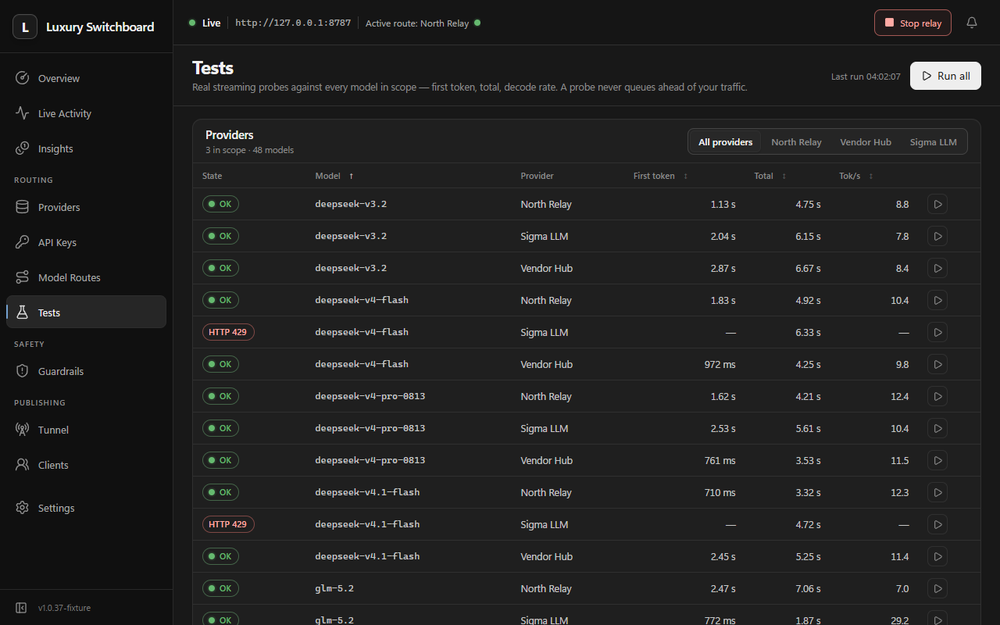
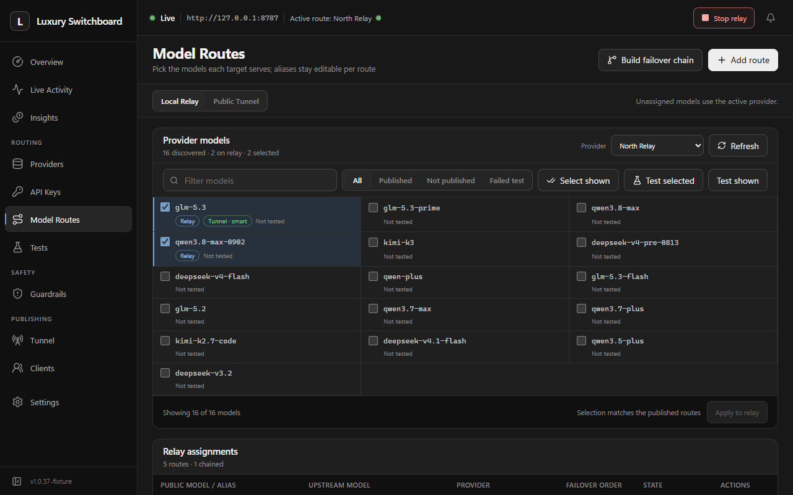
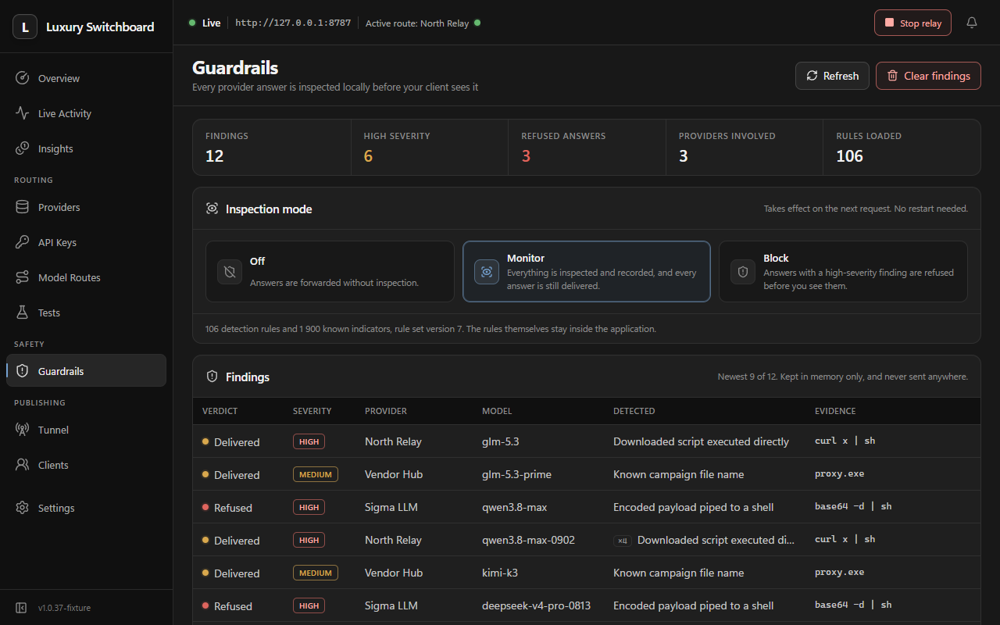
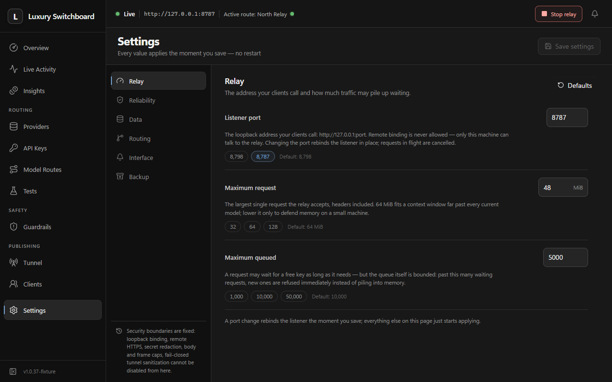
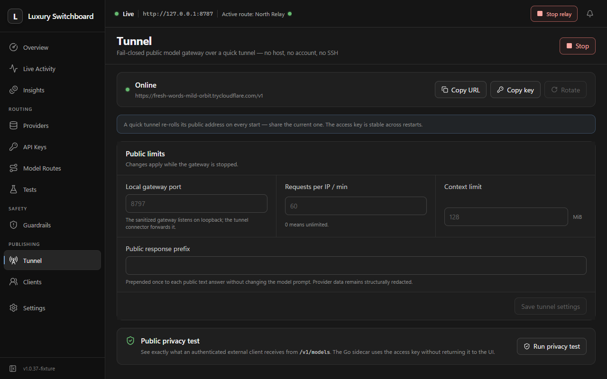

<div align="center">

# Luxury Switchboard

**One local endpoint for every AI provider you use.**<br/>
Fair key pools · honest costs · live model tests · a one-click public tunnel.<br/>
No account. No cloud of ours. No restart after any setting.

[](LICENSE)
[](https://github.com/GofMan5/luxury-switchboard/releases/latest)
[](https://github.com/GofMan5/luxury-switchboard/releases/latest)
[](https://github.com/GofMan5/luxury-switchboard/stargazers)



</div>

## Install

Grab the installer from the [latest release](https://github.com/GofMan5/luxury-switchboard/releases/latest): NSIS on Windows, AppImage/deb on Linux. Then:

1. **Providers**: add any OpenAI/Anthropic-compatible endpoint.
2. **API Keys**: paste keys, one per line. Encrypted per OS user, write-only after saving.
3. Point your client at `http://127.0.0.1:8798/v1`. Done.

## What you get

<table>
<tr>
<td width="50%" valign="top">

**Live Activity**: every request as it happens. Status, queue, retries, tokens, speed. A waiting request says why.



</td>
<td width="50%" valign="top">

**Insights**: usage and cost per provider and model, priced from your own catalog in your own currency.



</td>
</tr>
<tr>
<td width="50%" valign="top">

**Tests**: real streaming probes per model. First token, total, decode rate. Probes never queue ahead of your traffic.



</td>
<td width="50%" valign="top">

**Model Routes**: discover catalogs, publish models under your aliases, pin where each is served.



</td>
</tr>
<tr>
<td width="50%" valign="top">

**Guardrails**: every provider answer is inspected locally before your client sees a byte. Monitor by default; block when you say so.



</td>
<td width="50%" valign="top">

**Settings**: every value applies the moment you save it, with a plain-words explanation next to each.



</td>
</tr>
</table>

## The tunnel in one click

Press **Start** on the Tunnel page and you get an HTTPS address plus a stable access key. Share both, and someone else is on your models. Underneath: a pinned, checksum-verified [cloudflared](https://github.com/cloudflare/cloudflared) quick tunnel in front of a fail-closed gateway. No account anywhere, nothing of ours in the middle.

- **The address re-rolls every start; the key doesn't.** Need a permanent URL? Point any tunnel at the same local gateway, it doesn't care.
- **Fail-closed means fail-closed.** Only your published aliases, only with the key. Provider names, upstream URLs and raw model IDs are structurally absent from what leaves. Not redacted: absent. A refused provider answers exactly like an offline one.
- **Clients get their own page**: per-address history, bans, notes. Stored locally, never published.



## Private by construction

Everything lives on your disk (`%LOCALAPPDATA%\ProviderSwitchboard` / `~/.config/provider-switchboard`): config encrypted with DPAPI or the desktop keyring, no plaintext fallback, and the history in local SQLite. The app's only self-initiated outbound call is the GitHub release check; read it in one file (`backend/internal/slices/updates`). Delete the folder, nothing remains.

## Development

Go 1.25+ · Rust 1.96+ · Node 24+ · pnpm 10+.

```powershell
pnpm install
pnpm dev      # the desktop app, debug relay on :18798
pnpm check    # the whole gate: go vet + tests + race, tsc, lint, vitest, builds
pnpm build    # the native installer for this host
```

Linux build hosts also need `libwebkit2gtk-4.1-dev libappindicator3-dev librsvg2-dev patchelf libfuse2`.

The engineering contract (hexagonal slices, the fail-closed boundary, the honesty rules) lives in [AGENTS.md](AGENTS.md), written for people and coding agents alike.

## License

[MIT](LICENSE) · third-party attributions in [NOTICE](NOTICE) · guardrail data vendored from [holone](https://github.com/vanndh/holone) (MIT) · tunnel connector [cloudflared](https://github.com/cloudflare/cloudflared) (Apache-2.0, downloaded on first use at a pinned checksum).

<div align="center">

[](https://star-history.com/#GofMan5/luxury-switchboard&Date)

</div>
